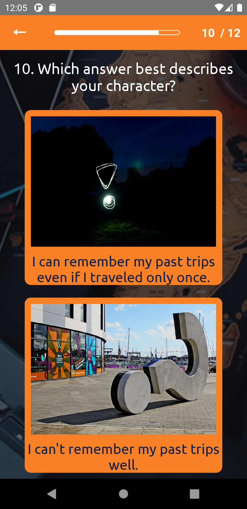
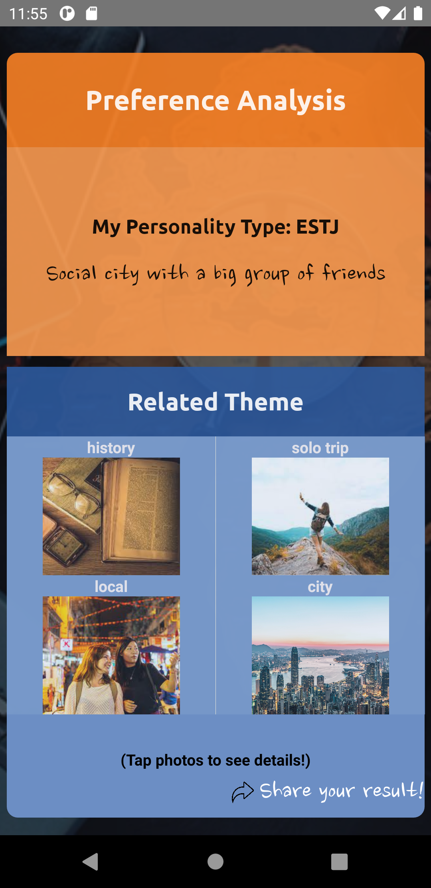
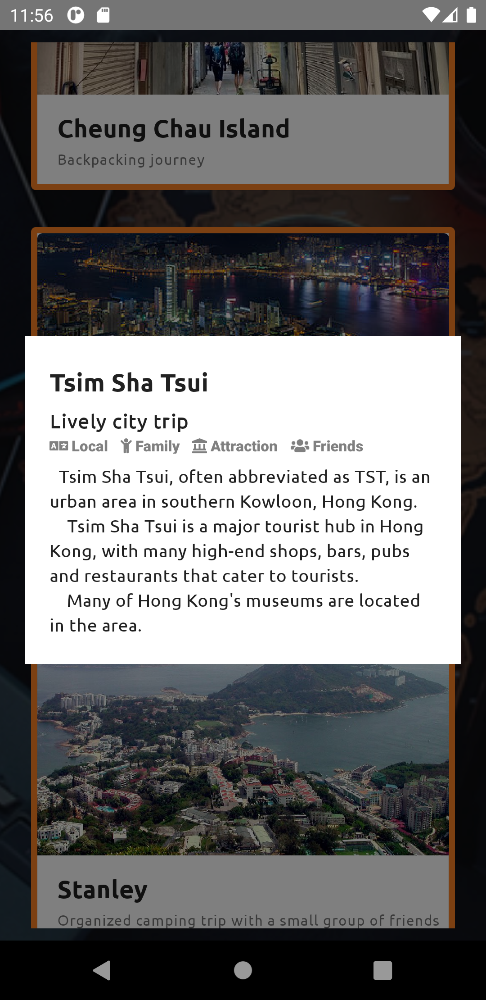

# MBTI Travel Planner by Team BabyAirForce


> This is an android APP built with react-native that plans a travel automatically.

Sometimes planning a travel is an exhausting job. The APP asks users a set of interesting questions where the responses are used to inspect the users personalities. Based on the result, it automatically recommends a themed travel plan that matches the users personalities. The process is designed in a way so that it is fun and effortless to the users.

## Project description
We have used react-native which is a framework designed to build a mobile application for an effective development.
- All the source codes we have written are located in the '_src_' folder.
- All the images, fonts, sounds used are located in the '_res_', 'fonts', 'sounds', folder respectively.

## Usage
|  |  |  |
| --- | --- | --- |

It has prepared 12 different questions in total to judge the users' personalities. The questions will be asked first and the related themes will be displayed that suit the users' personalities.
Then the users can check out the details of the places and the attractions associated with each theme by tapping on the picture. 
On top of that, the users can share the results on a social network of their choice to interact with their family of friends, possibly making more people being interested in this APP.


## Development setup
Windows:  
**Node**, **JDK** and **Android studio** are required.  
For a detailed installation process, you may refer to [this page](https://reactnative.dev/docs/environment-setup).

## Installation and execution
First of all, open a virtual device using android studio.  
Then, on the project folder, type the following on a CLI.
```sh
npm install
```
After that type the following to run the project on the virtual device.
```sh
npx react-native run-android
```
If everything is doen correctly, you should be able to see the APP running on the device.
