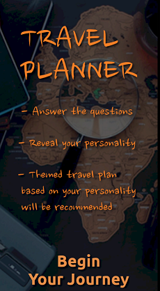

# MBTI Travel Planner by Team BabyAirForce

> This is an android APP built with react-native that plans a travel automatically.

Sometimes planning a travel is an exhausting job. The APP asks users a set of interesting questions where the responses are used to inspect the users personalities. Based on the result, it automatically recommends a themed travel plan that matches the users personalities. The process is designed in a way so that it is fun and effortless to the users.

## Project description
We have used react-native which is a framework designed for a mobile application development. 
- All the source codes we have written are located in the '_src_' folder.
- All the images, fonts, sounds used are located in the '_res_', 'fonts', 'sounds', folder respectively.

## Development setup
Windows:  
**Node**, **JDK** and **Android studio** are required.  
For a detailed installation process, you may refer to [this page](https://reactnative.dev/docs/environment-setup).

## Installation and execution
First of all, open a virtual device using android studio.  
Then, on the project folder, type the following on a CLI.
```sh
npm install
```
After that type the following to run the project on the virtual device.
```sh
npx react-native run-android
```
If everything is doen correctly, you should be able to see the APP running on the device.